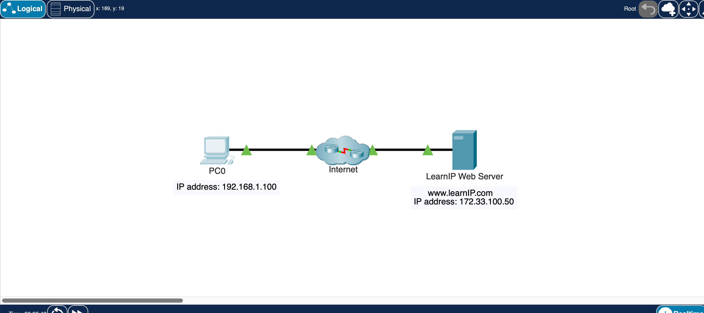
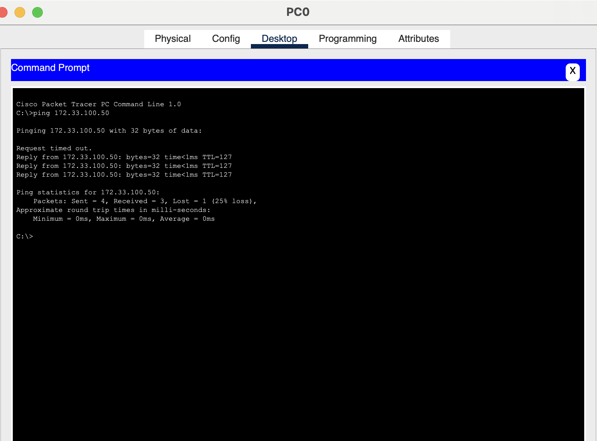
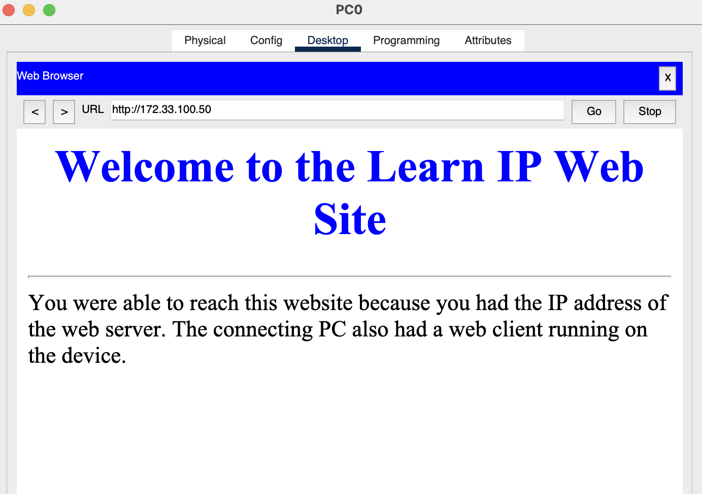

# Lab 02 – Web Server Connection

## Objective
The goal of this lab was to see how a PC communicates with a web server over a network using IP addresses. This helps understand how devices on the Internet find each other and exchange information.

## Key Steps

### Part 1: Tested connectivity with ping
I opened the command prompt on PC0 and used the ping command to send small packets to the web server’s IP address (172.33.100.50).
- This allowed me to check if the PC could reach the server.
- The server replied, confirming the connection was successful.
- I noticed sometimes the first packet timed out because the devices were still discovering each other, which was a good reminder of how networks initialize communication.

### Part 2: Connected to the web server through a browser
After confirming connectivity, I opened the web browser on PC0 and typed the server’s IP address.
- The web page loaded successfully, showing “Welcome to the Learn IP Web Site.”
- This demonstrated how a web client uses an IP address to reach a server and retrieve a web page.

## Screenshots
- Network Topology 
- Ping Results 
- Web Page 

## Key Takeaways
- Learned how to verify network connectivity using ping.
- Observed how IP addresses allow PCs to reach servers. 
- Practiced connecting a PC to a web server using a web client.  
- Gained a better understanding of how the Internet delivers packets.

